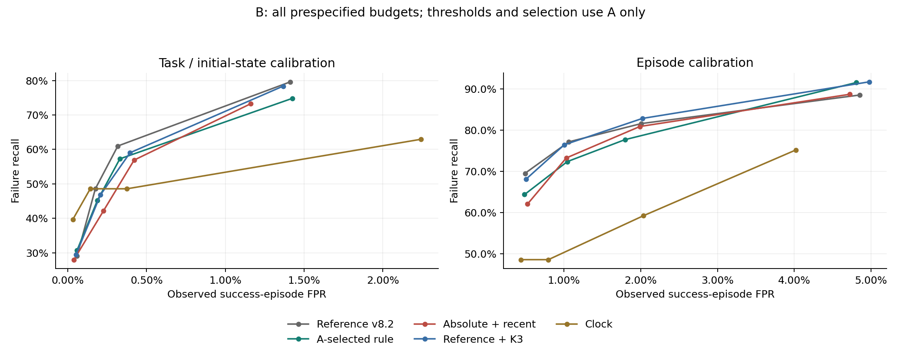
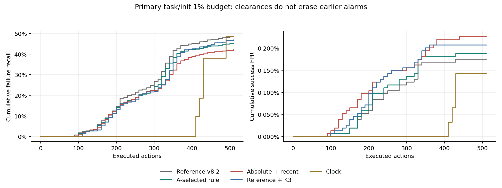
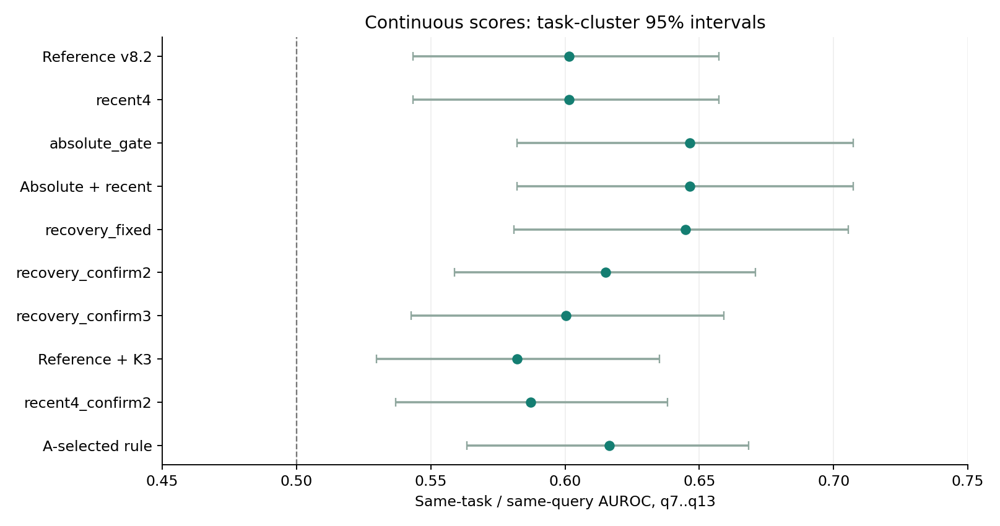

# v8.2-R 改进实验结果

2026-09-08。依据先前的可恢复异常假设，实现九项预先固定候选和可清除状态接口。
主设置的检测性能**没有改善**：同折、同成功校准预算下，对照 274 TP / 27 FP，
开发选中版本 255 TP / 29 FP。因此本轮不建议用该选型流程替换原检测规则。
状态接口改进与检测性能改进分开评价。没有新 rollout、物理干预或策略训练。

## 1. 改了什么

- 冻结头增加当前绝对低 mobility 的同时支持；两种参考标准化证据取 min。
- 扰动的两项持续证据限于最近四个 query，避免整个历史永久锁存后参与当前报警。
- 提供 NORMAL / WATCH / ALARM 和信号清除；连续两个有效 query 不超过 WATCH 阈值才清除。
  `ever_alarm` 和 `first_alarm_query` 不随清除重置，因此没有从 FPR 中扣掉自恢复候选。
- 检验总分 K2/K3 的持续确认、去除时间斜率，并包含只延长原分数确认的对照。

当前冻结参考不随执行更新。只用路由概率，物理状态和最终成败不进入在线接口。
WATCH 是独立的名义 10% 成功校准预算，并非“无需计数的报警”。
ALARM 清除仅表示当前路由证据减弱，不表示物理恢复。含旧永久锁存分支的候选仍可能不清除。

## 2. 公平比较和开发选择

40 个任务，A/B 共 32,000 条。全部 B 16,000 条，564 失败、15,436 成功，每条测试一次。
五折每折 A 参考 6,400、A 成功校准池 3,200、A 开发选择 3,200、B 测试 3,200。
四部分 task/init 互斥；只用 A 开发标签选择候选。
参考只确定尺度，成功校准只确定全程峰值阈值，开发只决定候选，三者分离。

主预算是 task/init 名义 1%，不是 B 的实际 FPR 保证。
同折重建的 `v82_reference` 与新候选共享参考和校准划分；它不是原冻结多阈值 v8.2。
原冻结完整 B 的 475 TP / 99 FP 是另一个工作点，不能把改进版相对它少报警说成同预算改善。

开发规则要求 TP 不低于对照、FP 不高于对照，再最大化对较早报警加权的效用。
效用为失败轨迹的 `exp(-max(first_q-7,0)/12)` 均值，漏检记零。
以下只列 A 开发结果，不能当作 B 检测数：

| 折/在线配置 | 选中候选 | 开发 TP | 开发 FP |
| --- | --- | --- | --- |
| 0 | v82_reference | 47 | 3 |
| 1 | v82_reference | 66 | 2 |
| 2 | v82_reference | 55 | 7 |
| 3 | recovery_fixed | 32 | 2 |
| 4 | v82_reference | 83 | 3 |
| deploy | v82_reference | 62 | 9 |

选择清单在输出 B 指标前固定于 [selection_frozen.json](selection_frozen.json)。
A/B 已用于历史研究，候选设计也受其启发；本轮仍是回顾性开发，不能宣称新的独立盲测。

## 3. 主工作点的完整 B 消融

| 候选 | TP | FP | 召回 | 实测 FPR |
| --- | --- | --- | --- | --- |
| v82_reference | 274 | 27 | 48.58% | 0.17% |
| recent4 | 274 | 27 | 48.58% | 0.17% |
| absolute_gate | 238 | 35 | 42.20% | 0.23% |
| recovery | 238 | 35 | 42.20% | 0.23% |
| recovery_fixed | 248 | 44 | 43.97% | 0.29% |
| recovery_confirm2 | 238 | 29 | 42.20% | 0.19% |
| recovery_confirm3 | 247 | 27 | 43.79% | 0.17% |
| reference_confirm3 | 264 | 32 | 46.81% | 0.21% |
| recent4_confirm2 | 263 | 28 | 46.63% | 0.18% |
| selected | 255 | 29 | 45.21% | 0.19% |
| clock | 274 | 22 | 48.58% | 0.14% |

选中流程相对同预算对照补获 11 条失败、丢失 30 条，
增加 2 条成功误报、去掉 0 条。
共同检出的 244 条中 1 条更早、22 条更晚。
配对 task 簇区间：召回率差 [-10.90, 1.15] 个百分点，
FPR 差 [0.00, 0.04] 个百分点。

在固定相同数值阈值时，AND 门只会减少越界；重新做成功预算校准后阈值会变化，
所以增加 AND 门并不保证测试误报下降。本轮结果正说明，合理的局部约束不自动改善整个监测器。

## 4. 所有预先固定预算

| 校准单位 | 名义预算 | 对照 TP / FP | 开发选中 TP / FP |
| --- | --- | --- | --- |
| episode | 0.50% | 392 / 76 | 363 / 75 |
| episode | 1.00% | 435 / 164 | 408 / 161 |
| episode | 2.00% | 460 / 310 | 438 / 277 |
| episode | 5.00% | 499 / 749 | 516 / 742 |
| task_init | 0.50% | 164 / 9 | 173 / 9 |
| task_init | 1.00% | 274 / 27 | 255 / 29 |
| task_init | 2.00% | 344 / 49 | 323 / 51 |
| task_init | 5.00% | 449 / 218 | 422 / 220 |

部分次要工作点出现收益，主工作点却退化。不能在看到 B 结果后把有利预算改称主设置。
时钟在主工作点也能达到 274 TP / 22 FP，但报警明显更晚，因此最终计数必须结合时机。



## 5. 时间控制与早期排序

| 方法 | q | 累计 TP | 累计 FP |
| --- | --- | --- | --- |
| v82_reference | 7 | 0 | 0 |
| v82_reference | 10 | 10 | 1 |
| v82_reference | 13 | 16 | 1 |
| v82_reference | 20 | 82 | 9 |
| v82_reference | 30 | 151 | 19 |
| v82_reference | 51 | 274 | 27 |
| recovery | 7 | 0 | 0 |
| recovery | 10 | 5 | 2 |
| recovery | 13 | 18 | 8 |
| recovery | 20 | 73 | 16 |
| recovery | 30 | 126 | 24 |
| recovery | 51 | 238 | 35 |
| reference_confirm3 | 7 | 0 | 0 |
| reference_confirm3 | 10 | 0 | 1 |
| reference_confirm3 | 13 | 15 | 3 |
| reference_confirm3 | 20 | 73 | 15 |
| reference_confirm3 | 30 | 123 | 24 |
| reference_confirm3 | 51 | 264 | 32 |
| selected | 7 | 0 | 0 |
| selected | 10 | 8 | 1 |
| selected | 13 | 15 | 1 |
| selected | 20 | 79 | 11 |
| selected | 30 | 137 | 21 |
| selected | 51 | 255 | 29 |



同 task、同 q 的 q7..q13 连续 AUROC，先平均 query 再平均 task；36 个任务可比较。
区间按 task 簇在 suite 内重采样 2,000 次，以已拟合 profile 为条件。

| 连续分数 | 早期 AUROC [95% 区间] |
| --- | --- |
| absolute_gate | 0.646 [0.582, 0.707] |
| recent4 | 0.602 [0.543, 0.657] |
| recent4_confirm2 | 0.587 [0.537, 0.638] |
| recovery | 0.646 [0.582, 0.707] |
| recovery_confirm2 | 0.615 [0.559, 0.671] |
| recovery_confirm3 | 0.600 [0.543, 0.659] |
| recovery_fixed | 0.645 [0.581, 0.705] |
| reference_confirm3 | 0.582 [0.530, 0.635] |
| selected | 0.616 [0.563, 0.668] |
| v82_reference | 0.602 [0.543, 0.657] |

同一批 task 的配对 AUROC 增量：

| 连续分数 | 相对对照的增量 [95% 区间] |
| --- | --- |
| absolute_gate | 0.045 [0.014, 0.083] |
| recovery | 0.045 [0.014, 0.083] |
| selected | 0.015 [0.002, 0.028] |

绝对低 mobility 约束改善了早期排序，但没有同步改善主预算的整轨迹检出。
这提示早期排序质量、极低误报的阈值尾部与后期召回需要分别诊断。



## 6. 状态清除不是删除误报

| 最终结果 | 轨迹数 | 曾 WATCH | 曾 ALARM | 观察到 ALARM 清除 | 报警后至少四个 query 可观察 |
| --- | --- | --- | --- | --- | --- |
| 成功 | 15436 | 551 | 29 | 17 | 24 |
| 失败 | 564 | 465 | 255 | 44 | 203 |

成功和失败的剩余观察时间不同，因此清除比例本身不能证明物理恢复能力。
各轨迹状态存于 [state_episodes.csv](state_episodes.csv)，全部 query 状态存于 `states.npz`。

先前九条释放-报警-再抓取成功候选，仅作诊断。这些来自三个 task/init 组合，且不是独立 trap 标签。
下表同时保留同预算对照，避免把更保守校准造成的少报警归因于恢复机制：

| 全局行号 | 原冻结报警 q | 同预算对照 q | 选中版本 q | 再抓取 q | 最后路由状态 |
| --- | --- | --- | --- | --- | --- |
| 5314 | 10 | -1 | -1 | 13 | NORMAL |
| 5315 | 9 | -1 | -1 | 14 | NORMAL |
| 5316 | 11 | -1 | -1 | 14 | WATCH |
| 5318 | 12 | -1 | -1 | 14 | WATCH |
| 15027 | 30 | -1 | -1 | 36 | NORMAL |
| 15760 | 24 | 28 | 28 | 31 | ALARM |
| 15763 | 24 | -1 | -1 | 28 | WATCH |
| 15765 | 24 | 30 | 30 | 31 | ALARM |
| 15767 | 24 | 43 | 43 | 32 | ALARM |

`-1` 表示未报警；再抓取和最终成功只用于事后诊断，没有反馈给分数或选型。

## 7. 在线接口和核验

单一在线配置由 A 的 9,600 参考 / 3,200 校准 / 3,200 开发导出，选中 `v82_reference`。
开发流程回退到原分数规则是有效结果，不强制采用退化候选。
五折指标评价选型流程，不能当作这个单一在线 profile 的独立泛化结果。

```python
from recovery import RecoveryGuardMonitor

guard = RecoveryGuardMonitor("profile_deploy.json", checkpoint=checkpoint_sha256)
result = guard.update(hb_router_probs)
# result: state, trigger_now, ever_alarm, first_alarm_query, signal_cleared
```

导入与运行路径见 [README](../../v82_recovery/README.md)。
独立重算 1,408,000 个报警判断、
480 个校准顺序统计量；
从原始 HUB Zarr 在线回放 97 条、
1736 个 query，覆盖 80 个 run，
首次报警与逐 query 状态全部一致。详见 [independent_verification.json](independent_verification.json)。

## 8. 结论

本轮交付了可清除状态接口和完整、可复现的改进实验；数据未支持在主工作点替换 v8.2。
绝对尺度对早期排序的收益可作为后续方向，但“额外 AND 条件 + 更长确认”缺乏稳定的全程收益。
下一轮需要独立的任务进展与恢复标注，区分正常阶段变化、可恢复停滞和持续无进展；
这些信息是否能只由路由可靠推断，仍是待解决的问题。本轮到此停止候选搜索。
