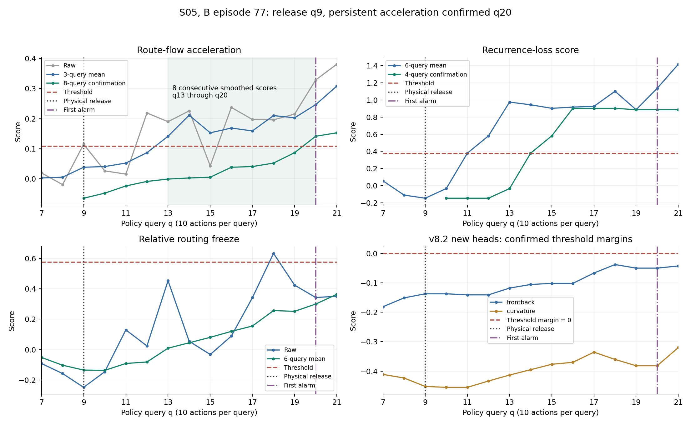

# S05：盘子旁黑碗任务为何在 90.9% 才报警

2026-09-08。任务为 `libero_spatial/pick_up_the_black_bowl_next_to_the_plate_and_place_it_on_the_plate`。
完整 B 批本任务 400 条轨迹：24 失败、376 成功。原冻结 v8.2 检出 18 条失败、误报 2 条成功。
报警 query 的中位数为 q20，对应已执行 200/220 = 90.9% 的任务动作预算。
这是位置统计，任务预算与最终轨迹长度没有参与检测分数。

## 主要原因：持续扰动分支的连续确认

18 次失败报警中，13 次由 turbulence 分支首发或并列首发；其中 12 次最后等待的是
加速度分支完成连续确认，1 次最后等待周期性分支。其余 5 次中，3 次是前后层比值首发，
2 次是 freeze 首发。

turbulence 要同时满足两个已经确认的历史信号：

- 路由加速度分数：相对开头基线取对数，先做 3-query 平均，再连续 8 个 query 高于 0.1075075。
- 路由周期性损失分数：先做 6-query 平均，再连续 4 个 query 高于 0.3749159。

两个确认结果分别锁存；二者都已经满足后才触发 turbulence。
这里的加速度是后层路由分布在单次去噪过程中的二阶变化，不是机械臂的物理加速度。

这 13 条 turbulence 首发或并列轨迹中，从加速度平滑分数首次越界到完成确认：
10 条相隔 7 个 query，另外 3 条相隔 9、10、12 个 query。后者的中间回落打断了连续计数。

## 一条可直接核对的轨迹

B 批 episode 77，init_state_id=9，global_row=27677：

| query | 已用预算 | 已有观测或规则状态 |
| --- | ---: | --- |
| q9 | 40.9% | 保存的物理状态出现尚未满足目标时释放黑碗；路由加速度原始分数短暂越界 |
| q13 | 59.1% | 加速度 3-query 平均达到 0.1413，开始连续高于 0.1075 |
| q14 | 63.6% | 周期性分支完成自己的 4 次确认，但加速度尚未满足 8 次 |
| q19 | 86.4% | 加速度 8-query 窗口仍含 q12 的 0.0867，未超过阈值 |
| q20 | 90.9% | 窗口变成 q13～q20，8 个分数均超过阈值，最终报警 |

从 q13 到 q20 是 8 次观测、7 个 query 间隔，即 70 个动作。
因此本例中路由分数在中段已有变化，后续的连续确认造成了明确的触发延迟。
本例的 freeze 平滑分数全程不足阈值；两个新增头的确认后阈值余量也都为负，无法提前触发。

## 其他分支为何没有提前接替

按原冻结规则，在全部 24 条失败中，freeze 分支有 4 条触发，前后层比值分支有 5 条触发，
曲率分支没有触发。这些是各分支全程是否触发，存在重叠，不能相加为最终检出数量。
前后层比值在 episode 28 和 167 的 q11 就触发了报警；在该任务其余大多数失败上没有更早接替。

最终首次报警分布：q11 两条、q17 一条、q18 三条、q19 两条、q20 六条、q21 四条；
另有六条全程未报警。q20～q21 共 10/18 条，因此首次报警中位数落在 q20。

24 条失败中，22 条在保存的检查点有目标未满足时释放的记录，发生在 q7～q11；
这 22 条中有 16 条被检出，释放到报警的间隔中位数是 10 个 query，即 100 个动作。
另两条没有在离散检查点捕捉到该事件，不补造释放时刻。
本任务也有 22 条最终成功轨迹出现同类释放记录；释放本身不是不可逆失败或 trap 的标签。

## 六条漏检

| episode | 初态 | 加速度平滑分数最长连续越界 | 周期性平滑分数最长连续越界 |
| --- | ---: | ---: | ---: |
| 96 | 12 | 5 | 2 |
| 102 | 12 | 5 | 10 |
| 286 | 35 | 5 | 10 |
| 363 | 45 | 5 | 3 |
| 366 | 45 | 4 | 2 |
| 367 | 45 | 3 | 2 |

六条的加速度分数都曾越界，但最长仅连续 3～5 次，均未达到 8 次；其中四条的周期性
分支也未完成 4 次确认。freeze 与两个新增头也未触发，因此没有分支补回这些漏检。
六条漏检集中在三个初态，不能视为六种独立的失效机制。

## 固定阈值的诊断对照

仅将加速度连续确认次数从 8 改为 1，保留 3-query 平滑、周期性 4 次确认、freeze、
两个新增头和全部阈值。开头基线必须已经观测到，最早从 q7 评价该加速度信号。
这是为检验延迟来源追加的离线诊断，不是重新选出的替代版本，没有修改原监测器。

| 数据范围 | 规则 | 失败检出 | 成功误报 |
| --- | --- | ---: | ---: |
| 本任务 24 失败 / 376 成功 | 原冻结 v8.2 | 18 | 2 |
| 本任务 24 失败 / 376 成功 | 仅取消加速度连续确认 | 20 | 2 |
| 完整 B：564 失败 / 15,436 成功 | 原冻结 v8.2 | 475 | 99 |
| 完整 B：564 失败 / 15,436 成功 | 仅取消加速度连续确认 | 511 | 377 |

本任务的报警中位数从 q20 (90.9%) 提前到 q14 (63.6%)；原有 18 条检出中，15 条提前，
另外补回 episode 102、286。完整 B 的误报却增加 278 条，全部增量来自其他任务。
这支持连续确认是本任务的重要延迟来源，也说明不能仅依据这个任务直接取消全局确认规则。

本任务的改进方向应围绕如何更早确认有效扰动，同时保持跨任务误报表现；当前数据不能
证明把连续确认简单缩短就是可靠的新方案，也不能由路由越界直接推断 trap 的真实起点。

## 产物与验证

- [逐轨迹分支、物理事件和诊断结果](episodes.csv)。
- [逐 query 路由分数](score_streams.csv)，基线尚未观测到的早期读数留空。
- [本任务与完整 B 的诊断对照](fixed_threshold_diagnostic.csv)。
- [原阈值](profile.json)、[PDF 图](episode_77_diagnosis.pdf)、[核验记录](verification.json)。

输入特征和物理状态缓存哈希已核对。全部 16,000 条 B 的原 v7 报警、本任务 400 条的
原 v8.2 报警及首次触发分支均复现；从已有物理状态数组独立重算 400 条释放记录并逐项匹配。
另逐前缀检查分数，确认没有借用未来的开头基线。没有新的 rollout 或模型训练。

复现：`OPENBLAS_NUM_THREADS=1 OMP_NUM_THREADS=1 python moe_trainfree/v82_validation/diagnose_s05.py --output /tmp/v82_s05_reproduction`。
输出目录必须不存在。
