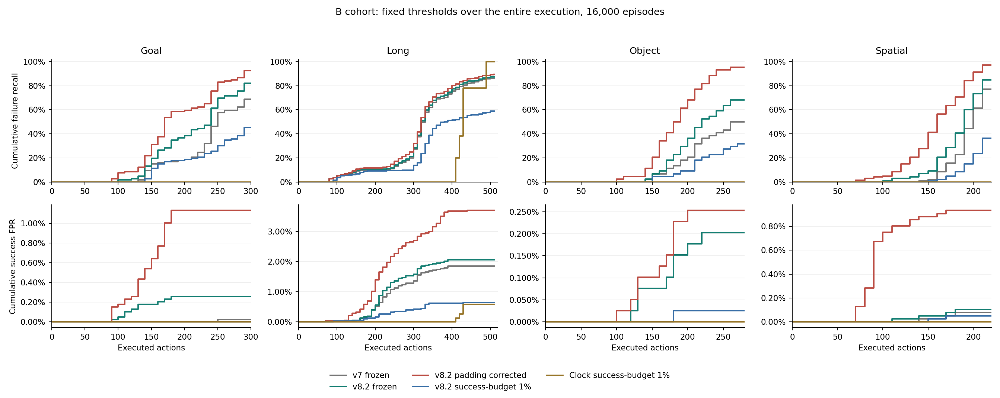
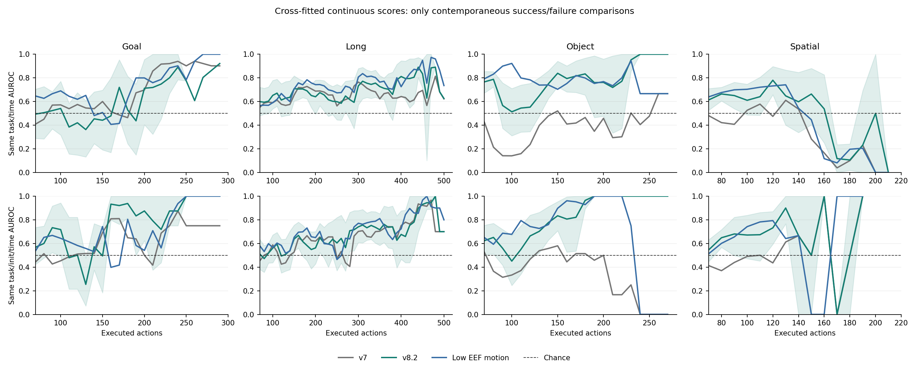
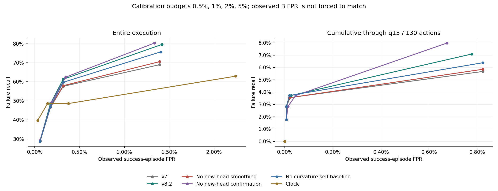
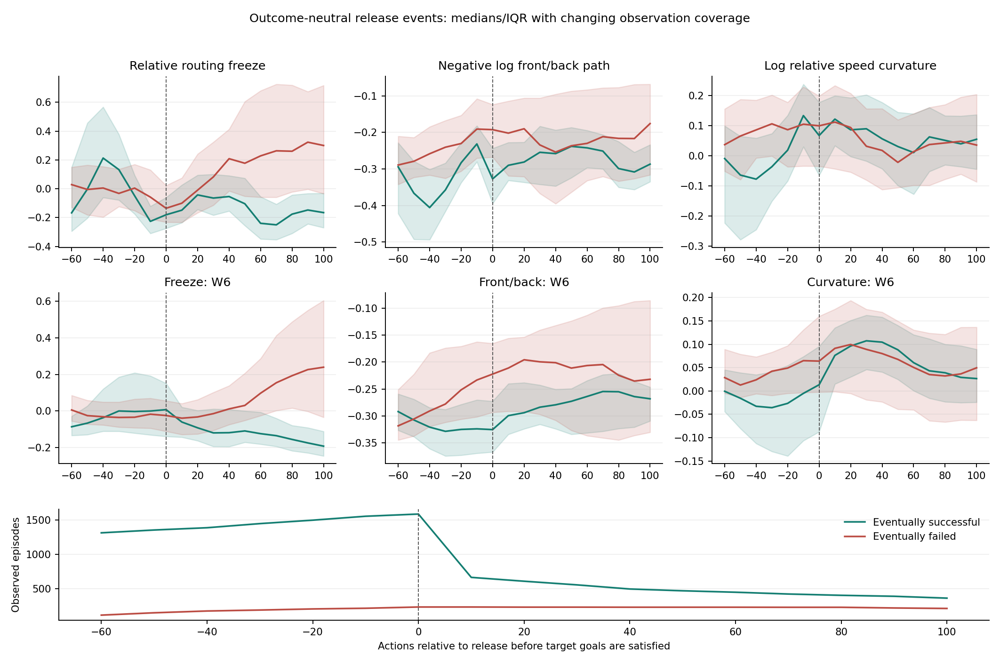

# v8.2 现有 HUB 数据补充验证

日期：2026-09-08。完成时间控制、完整成功轨迹的累计误报、分支消融、成功物理事件对照。
结果支持路由中存在有限的成败关联，但不支持把当前工作点解释成强的物理事件前预测器。
没有训练模型、修改原始数据或生成新 rollout；本轮属于历史数据上的回顾性验证。

## 1. 覆盖与校验

- A/B 共 32,000 条，40 任务，508,023 个 query；逐 run 核对 HUB summaries 和原始物理结果标签。
- 主测试 B：16,000 条，564 失败、15,436 成功。旧共同 B 是 15,600 条，少一个 Object 任务。
  因而旧报告冻结 v8.2 的 98 FP 在本轮完整 B 上为 99 FP；旧共同集合逐位重现。
- 五折按初态隔离：每折 A 参考 9,600、A 校准 3,200、B 测试 3,200；全部 B 恰好测试一次。
- 独立重算 1,536,000 个报警判断，全部相等；从 HUB 原始 Zarr
  重放 80 条、1228 个 query，覆盖全部 80 个 run。
- B 的全部保存物理状态已恢复；826 个既有目标物体释放标签逐项一致。
- 95% 区间按 task 簇、suite 内重采样；query 不是独立样本，区间以已拟合 profile 为条件。

## 2. 补齐修正改变了工作点

原校准把全 NaN 补齐区变为零。修正版只排除这些无效 query，保留原 14,800 条 A、
原 partial warm-up 均值、W6、K2、基线、时间斜率以及 v7 profile，没有用 B 重新选参数。
前后比对数低阈值由 0 变为 0.06585970；
相对曲率高阈值由 0.38900006 变为 0.30387442。

| 冻结/修正版 | TP | FP | 召回 | FPR |
| --- | --- | --- | --- | --- |
| v7_frozen | 439 | 81 | 77.84% | 0.52% |
| v8_frozen | 460 | 91 | 81.56% | 0.59% |
| v82_frozen | 475 | 99 | 84.22% | 0.64% |
| v82_padding_corrected | 521 | 228 | 92.38% | 1.48% |
| v8_padding_corrected | 501 | 152 | 88.83% | 0.98% |
| v7_corrected_frontback | 509 | 143 | 90.25% | 0.93% |
| v7_corrected_curvature | 486 | 169 | 86.17% | 1.09% |

修正后召回和误报同时上升。前后比阈值恰好为零不能作为天然机制临界点。
原冻结版仍作为历史工作点保留，其低误报数字不等于校准正确或存在误报概率保证。

## 3. 检查点只统计累计结果

预算校准版本用完整成功轨迹的全程峰值校准一次；原冻结与补齐修正版使用第二节的固定规则。
所有版本都统计截至各 q 是否曾报警，不在检查点重新调整阈值。结束前的误报保留，
已结束成功轨迹仍在总分母中；下面“仍运行成功”只说明暴露情况，不替换 FPR 分母。
完整 q0..q51 见 [cumulative_curves.csv](cumulative_curves.csv)。

| 方法 | q | 累计 TP | 累计 FP | 仍运行成功 |
| --- | --- | --- | --- | --- |
| v82_frozen | 7 | 0 | 1 | 15299 |
| v82_frozen | 10 | 17 | 3 | 11178 |
| v82_frozen | 13 | 29 | 12 | 6735 |
| v82_frozen | 20 | 189 | 42 | 3431 |
| v82_padding_corrected | 7 | 2 | 6 | 15299 |
| v82_padding_corrected | 10 | 30 | 38 | 11178 |
| v82_padding_corrected | 13 | 65 | 62 | 6735 |
| v82_padding_corrected | 20 | 253 | 142 | 3431 |
| v82 | 7 | 0 | 0 | 15299 |
| v82 | 10 | 10 | 1 | 11178 |
| v82 | 13 | 16 | 1 | 6735 |
| v82 | 20 | 82 | 9 | 3431 |
| clock | 7 | 0 | 0 | 15299 |
| clock | 10 | 0 | 0 | 11178 |
| clock | 13 | 0 | 0 | 6735 |
| clock | 20 | 0 | 0 | 3431 |

`v82` 和 `clock` 行属于五折标准化、task/init 1% 成功预算版本。



## 4. 同任务、同时间的区分能力

q7..q13 预先固定；仅在同任务、同 q 且有成功与失败仍在运行的分层内比较。
先对 query、再对 task 平均。36 个任务有两类对照，其他任务不可估计，不记为 0.5 或 1。

| 分数/报警 | 平均 AUROC [95% 区间] | 任务数 |
| --- | --- | --- |
| v7 | 0.468 [0.420, 0.512] | 36 |
| v82 | 0.602 [0.543, 0.658] | 36 |
| eef_motion_low | 0.696 [0.642, 0.754] | 36 |
| clock | 0.500 [0.500, 0.500] | 36 |
| v7_frozen_binary | 0.510 [0.500, 0.524] | 36 |
| v82_frozen_binary | 0.509 [0.496, 0.525] | 36 |
| v82_padding_corrected_binary | 0.519 [0.506, 0.535] | 36 |

`v7`/`v82` 是五折参考 median/MAD 标准化后的连续 guard，不能把其 AUROC 写成原冻结
布尔规则的 AUROC。`*_binary` 是原冻结工作点在 q 前是否已经报警的 0/1 值。
连续分数显示部分排序信息，但原冻结工作点早期检出很少；二者回答不同问题。

| suite | v7 连续 | v8.2 连续 | 末端低运动 |
| --- | --- | --- | --- |
| libero_goal | 0.520 | 0.490 | 0.675 |
| libero_long | 0.583 | 0.623 | 0.602 |
| libero_object | 0.246 | 0.626 | 0.824 |
| libero_spatial | 0.489 | 0.651 | 0.705 |

新增头相对 v7 有早期排序增量；总体上低运动量排序更强。分套件差异明显。
同 task/init/q 的跨噪声结果和完整支持数见 [early_conditional_summary.csv](early_conditional_summary.csv)
及 [conditional_auc_strata.csv](conditional_auc_strata.csv)。后期成功样本减少后，曲线不应外推为普遍辨别能力。



### 追加探索：进一步匹配运动量

该实验是在看到低运动基线较强后追加，见 [补充协议](../../v82_validation/MOTION_MATCH_ADDENDUM_ZH.md)。
同 task/q 内，以低运动量百分位差不超过 0.02 匹配成功对照。3833 个
可比较失败 query 中匹配 3356 个，涉及
564 条失败、1801 条唯一成功对照。
对照可重复使用，统计区间按 task 成簇。百分位差中位数 0.0025。

| 方法 | 正例分数较高的配对胜率 [95% 区间] | 任务数 |
| --- | --- | --- |
| v7 | 0.484 [0.423, 0.544] | 36 |
| v82 | 0.582 [0.522, 0.646] | 36 |
| eef_motion_low | 0.505 [0.454, 0.555] | 36 |

v8.2 的配对胜率提供“在近似相同运动量下仍有部分区分信息”的探索性证据。
这不是全体轨迹 AUROC，也不是完全消除运动混淆或证明机制因果性的结果。

## 5. 相同成功校准预算的消融

以下统一 task/init 名义 1% 预算；阈值来自独立 A 校准成功组的全程峰值。
这是预算校准的标准化分数族，区别于第二节原冻结多阈值规则。

| 消融版本 | TP | FP | 召回 | 实测 FPR |
| --- | --- | --- | --- | --- |
| v7 | 263 | 27 | 46.63% | 0.17% |
| v7_frontback | 264 | 27 | 46.81% | 0.17% |
| v7_curvature | 273 | 27 | 48.40% | 0.17% |
| v82 | 274 | 27 | 48.58% | 0.17% |
| v8_fixed | 272 | 27 | 48.23% | 0.17% |
| v82_no_smoothing | 263 | 27 | 46.63% | 0.17% |
| v82_no_confirmation | 278 | 29 | 49.29% | 0.19% |
| v82_no_curvature_baseline | 264 | 27 | 46.81% | 0.17% |
| frontback | 176 | 47 | 31.21% | 0.30% |
| curvature | 83 | 37 | 14.72% | 0.24% |
| eef_motion_low | 155 | 45 | 27.48% | 0.29% |
| clock | 274 | 22 | 48.58% | 0.14% |

平滑与曲率自基线在这个工作点提供增量。去掉连续确认带来少量额外检出与误报；
不能直接宣称 K2 一定更优。去掉时间斜率影响较小，说明新增收益不全部来自斜率。
时钟可用较晚报警达到相同全程 TP 数，但 q13 尚无检出，而标准化 v8.2 已有 16 TP / 1 FP。
应联合观察工作点、时机与套件，不能仅比较最终 TP。

名义预算不等于实际 B FPR，特别是 task/init 最大值校准较保守。
0.5%、1%、2%、5% 和 episode 校准完整结果均保留；没有根据测试集把实际 FPR 强行调齐。



## 6. 成功物理事件对照

同一套目标谓词、抓取和高度判据应用于全部 B 成功/失败轨迹。
每 episode 每类取第一次事件；不同事件类有重叠，不能相加为独立失败数。

| 事件 | 最终结果 | episode 数 |
| --- | --- | --- |
| goal_regression | 成功 | 16 |
| goal_regression | 失败 | 31 |
| release_height_loss | 成功 | 1337 |
| release_height_loss | 失败 | 205 |
| release_outside_goal | 成功 | 1594 |
| release_outside_goal | 失败 | 238 |

“目标尚未满足时释放”可以是正常放置过程的一部分；“释放后高度下降”也不等于不可恢复失败。
新规则基于释放当时的目标状态，区别于旧报告依据失败原因筛出的 216 条脱手子集。

| 方法 | 最终结果 | 事件数 | 事件前 | 同 q | 事件后 | 未报警 | 仅事件后延迟中位 q |
| --- | --- | --- | --- | --- | --- | --- | --- |
| v82_frozen | 成功 | 1594 | 13 | 0 | 29 | 1552 | 6.0 |
| v82_padding_corrected | 成功 | 1594 | 18 | 2 | 53 | 1521 | 5.0 |
| v82_budget01 | 成功 | 1594 | 2 | 0 | 10 | 1582 | 7.0 |
| v82_frozen | 失败 | 238 | 7 | 1 | 192 | 38 | 10.0 |
| v82_padding_corrected | 失败 | 238 | 9 | 3 | 212 | 14 | 8.0 |
| v82_budget01 | 失败 | 238 | 1 | 0 | 105 | 132 | 12.0 |

原冻结 v8.2 在 1,594 条最终成功、出现目标尚未满足时释放的轨迹上有 42 次误报，占 2.63%；
在 238 条最终失败的对应轨迹上有 200 次检出，其中 192 次发生在事件后。
这支持“持续异常的事后检出”，同时说明正常事件对照不可缺少。



曲线按独立物理事件对齐，保留各 offset 的真实观测数；终止后的值不补齐。
另提供完整 [-3,+4] query 窗口的敏感性结果，避免把变动的样本构成误当成恢复。
事件时刻的同任务/同 q 成功匹配、同初态优先以及缺乏成功对照的情况见
[event_control_pairs.csv](event_control_pairs.csv) 和 [event_matched_comparison.csv](event_matched_comparison.csv)。

成功状态恢复中 137 条出现保存检查点已满足全部目标，
多数在最后一个检查点；这些事实保留在 [明细](restored_goal_satisfied_successes.csv)。
BDDL 谓词和环境 API 一致，采集时的在线结果标签保持不变。
状态精度为 float32、间隔 10 动作，区间内事件和恢复后接触细节存在分辨率限制。

## 7. 结论边界

本轮支持的表述：路由动力学包含有限、任务相关的成败信息；持续规则能够在部分物理事件之后
形成低误报告警，但阈值校准、观察时长与简单运动量都显著影响结论。
追加运动匹配提供了互补信息的探索性证据，仍需在新的封存批次上确认。

本轮没有进行新的受控扰动或报警触发恢复实验。恢复保存状态用于补充标注，
不能替代失败机制的因果实验或闭环成功率评价；现有 A/B 也不构成新盲测。

## 8. 复现

在 `safe&vlaconf` 目录运行，下列默认输出已存在，重新完整计算时需使用新的输出目录：

```bash
python -m pytest -q moe_trainfree/v82_validation/test_validation.py
OPENBLAS_NUM_THREADS=1 OMP_NUM_THREADS=1 python moe_trainfree/v82_validation/run_analysis.py --output /tmp/v82-validation-replay
bash moe_trainfree/v82_validation/run_physical.sh --output /tmp/v82-physics-replay --workers 4
python moe_trainfree/v82_validation/analyze_events.py --analysis /tmp/v82-validation-replay --physics /tmp/v82-physics-replay
python moe_trainfree/v82_validation/verify.py --output /tmp/v82-validation-replay
```

当前标准产物的追加运动匹配和图文生成：

```bash
python moe_trainfree/v82_validation/motion_controls.py
python moe_trainfree/v82_validation/report.py
```

分折、原始回放、阈值和报警的完整核验见 [independent_verification.json](independent_verification.json)。
物理状态恢复保存在 [v82_physical_controls_20260908](../v82_physical_controls_20260908/verification.json)。
首次触发归因见 [head_attribution.csv](head_attribution.csv)。
