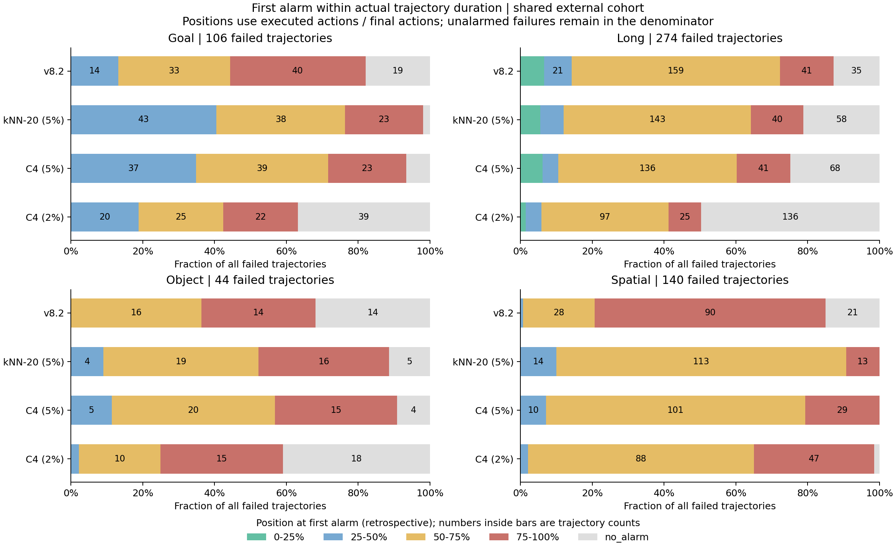
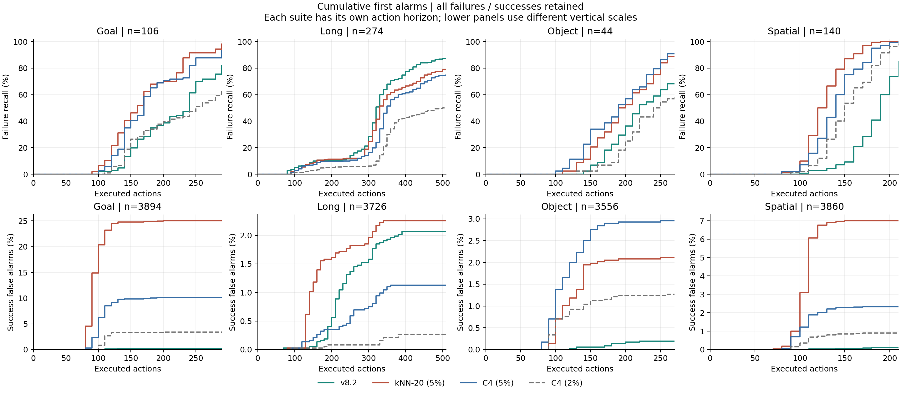

# 首次报警位置审计

日期：2026-09-08。针对 [v8 对照报告](../../V8_COMPARISON_ZH.md)，进一步检查报警发生的位置。范围仍是共同 B 批 15,600 条唯一轨迹，其中 564 失败、15,036 成功。全部结果来自已有首次报警，没有重新校准或改变监测规则。

**位置会改变对优劣的解释：Spatial 上原 v8 系列明显偏晚，几何方法更早；Long 上 v8.2 通常比 C4 更早。因此不能用全库报警精确率替代分套件的预警时机评价。**

## 1. 时间定义

- `q` 是从零开始的策略推理次数。报警时已经执行 `10*q` 个动作，当前新生成的动作尚未执行。
- 位置定义为 `10*q / actual_action_steps`，分母是该条轨迹最终实际动作数。这是事后描述，不是在线输入，也不表示语义上的任务完成百分比。
- 剩余动作数为 `actual_action_steps - 10*q`，不能直接解释为仍可恢复的时间。
- `q=-1` 表示执行期没有报警。旧 v8 的结束后补齐区报警已排除，原值另保存在逐轨迹表的 `*_original_q` 中。
- 中位数和四分位数只针对实际报警的轨迹；分布图保留所有未报警失败，避免把漏检从分母中删掉。
- q12.5 等小数是样本中位数，单条轨迹的报警 query 仍为整数。

## 2. 分套件的报警位置

以下针对各方法检出的失败。单元格依次为 **中位 q / 轨迹位置 / 剩余动作数**，几何方法使用 task/init 的名义 5% 校准。

| 套件 | v8.2 | kNN-20 | C4 |
| --- | --- | --- | --- |
| Goal | q21 / 70.0% / 90 | q16 / 53.3% / 140 | q17 / 56.7% / 130 |
| Long | q32 / 61.5% / 200 | q32 / 61.5% / 200 | q34 / 65.4% / 180 |
| Object | q20 / 71.4% / 80 | q19 / 67.9% / 90 | q19 / 67.9% / 90 |
| Spatial | q19 / 86.4% / 30 | q12.5 / 56.8% / 95 | q14 / 63.6% / 80 |

Spatial 的差异最明显：v8.2 的 119 次失败报警中，90 次发生在轨迹最后四分之一，占 75.6%；kNN 是 13/140，C4 是 29/140。

其他 v8 版本也应保留：Spatial 的原 v8/v8.3 中位数同为 q19，v8.1 为 q18；Long 的四个 v8 版本同为 q32。完整版本、成功误报位置和四分位数见 [summary.csv](summary.csv)。



颜色对应轨迹位置区间，灰色为未检出。每条横条的分母是该套件全部失败，而非仅已检出的失败。区间采用左闭右开，例如 `75-100%` 包含位置恰为 75% 的报警。

## 3. 同一失败轨迹上的先后比较

不同方法检出的失败集合不相同，因此不能直接把两个中位数相减当作逐轨迹提前量。下面只比较双方都有报警的同一失败轨迹。

| 套件 | C4 与 v8.2 共同检出 | C4 更早 | 同 q | C4 更晚 | C4 减 v8.2 的中位 q 差 |
| --- | ---: | ---: | ---: | ---: | ---: |
| Goal | 85 | 49 | 25 | 11 | -1 |
| Long | 193 | 7 | 11 | 175 | +2 |
| Object | 28 | 11 | 5 | 12 | 0 |
| Spatial | 119 | 115 | 3 | 1 | -3 |

Spatial 中 C4 在 115/119 条共同检出的失败上更早，中位提前 3 个 query，即 30 个动作；Long 中 C4 在 175/193 条上更晚，中位晚 2 个 query。

kNN 与 v8.2 在 Spatial 共同检出 119 条，kNN 更早 117 条、更晚 2 条，中位提前 5 个 query。Long 共同检出的 199 条中，kNN 更早 66 条、同 q 47 条、更晚 86 条，中位差为零。

完整比较还保留双方独有检出、双方都不报警以及成功误报上的先后关系，见 [paired_with_v82.csv](paired_with_v82.csv)。

## 4. 低误报是否伴随较晚的观察时刻

对每个任务，取共同 B 中所有成功轨迹的实际终止动作数。下面统计失败报警是否已经晚于或等于该任务最晚的成功终止时刻。

| 范围 | v8.2 | kNN-20 | C4 (5%) |
| --- | ---: | ---: | ---: |
| 全部共同 B，晚于最晚成功 / 失败报警 | 120/475 | 67/499 | 73/485 |
| Spatial，晚于最晚成功 / 失败报警 | 70/119 | 18/140 | 22/140 |
| Long，晚于最晚成功 / 失败报警 | 7/239 | 11/216 | 14/206 |

Spatial 的 v8.2 有 58.8% 的失败报警发生在同任务样本中全部成功轨迹均已终止之后。到这些位置才触发，成功样本已没有同样长的暴露时间，低误报就不能直接解释为强的早期成败辨别能力。

这项统计使用 B 批最终标签和时长，仅用于诊断观察位置，不是可部署的时间阈值，也没有输入任何监测器。它不证明算法读取了未来，更不表示全部 v8 检出都由时间解释；Long 的对应比例只有 7/239。

## 5. 相对物理脱手的位置

共同 B 有 216 条失败轨迹带目标物体脱手 query。这里只比较同一事件定义；该事件不等于不可逆失败起点。

| 方法 | 脱手前 | 同 q | 脱手后 | 未报警 | 仅在脱手后报警中的中位延迟 |
| --- | ---: | ---: | ---: | ---: | --- |
| v8.2 | 5 | 1 | 175 | 35 | 10 query，约 100 动作 |
| kNN-20 (5%) | 23 | 6 | 162 | 25 | 6 query，约 60 动作 |
| C4 (5%) | 10 | 10 | 166 | 30 | 6 query，约 60 动作 |

若对全部已报警的事件轨迹取中位数，包括事件前和同 q 的报警，则延迟分别为 9、5、5 个 query。两种条件分母不同，不能混写。

三者都以事件后报警为主。几何方法虽有较早的部分检出，也尚未解决事件前识别；“距离最终超时还剩很多动作”并不等于报警发生在错误之前。

一个可核查的位置例子：`global_row=27887`，Spatial 的 `pick_up_the_black_bowl_next_to_the_plate_and_place_it_on_the_plate`，B 批 episode 287、init 35、noise 1015：

| 标记 | query | 已执行动作 |
| --- | ---: | ---: |
| 脱手标注 | 10 | 100 |
| kNN 报警 | 13 | 130 |
| C4 报警 | 14 | 140 |
| v8.2 报警 | 19 | 190 |
| 最终终止 | 不属于报警 query | 220 |

此例按 Spatial 中三个报警位置接近各自中位数选择，用来说明时间单位；总体判断依据全部轨迹。事件时间直接采用已有标注，本次未重新观看视频确认物理状态。

## 6. 成功误报也要看位置

在各自发生误报的成功轨迹上，v8.2、kNN、C4 的报警位置中位数分别是 71.9%、77.5%、77.5%。因此 kNN 的 q 较早，并不意味着它对成功轨迹总是在开始阶段误报；很多成功轨迹本身很短。



上排是全部失败中的累计检出率，下排是全部成功中的累计误报率。各套件使用各自的真实动作时刻；下排纵轴范围不同，读取时应保留刻度。完整逐 query 的累计数、仍在运行数量以及尚未报警的运行轨迹数见 [query_distribution.csv](query_distribution.csv)。

## 7. 导出与复现

- [episode_positions.csv](episode_positions.csv)：15,600 行，包含每条轨迹的身份、成败、实际长度、事件标注，以及七种方法的原始或有效首次 query、动作位置、剩余动作数、事件延迟。
- [summary.csv](summary.csv)：70 行，按套件、方法、成败分组的分位数与计数。
- [position_bins.csv](position_bins.csv)：350 行，四个时间位置区间及未报警的完整分布。
- [paired_with_v82.csv](paired_with_v82.csv)：70 行，同轨迹先后比较和检出集合差异。
- [task_success_endpoints.csv](task_success_endpoints.csv)：39 个任务的成功终止位置，仅供事后诊断。
- [verification.json](verification.json)：输入及输出哈希、执行区过滤计数、定义和检查记录。
- 图的 PDF：[位置分布](failure_positions.pdf)、[累计报警](timing_curves.pdf)。

从 `safe&vlaconf` 目录运行，输出目录须不存在：

```bash
PYTHONDONTWRITEBYTECODE=1 OPENBLAS_NUM_THREADS=1 OMP_NUM_THREADS=1 \
python moe_trainfree/boundary_knn/analyze_alarm_positions.py \
  --output /tmp/himoe-v8-alarm-positions
```

已核对独立成败标签、轨迹身份/长度/初态/噪声种子、原有整轨迹 TP/FP 锚点，以及分箱、检出集合、事件关系的计数守恒。所有输出报警均位于实际执行区。参考任务范围和历史选型的可比性限制仍与上份报告相同。
