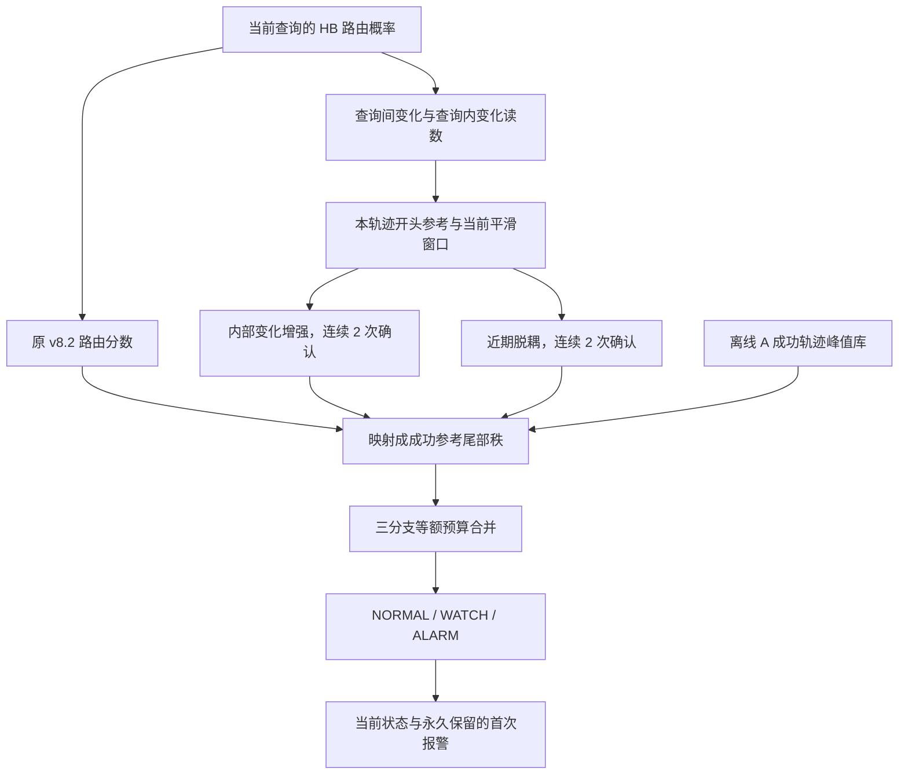

# 当前无训练路由监测方法：完整流程

本文按当前代码说明已实现的流程。方法定位为“基于内部路由动力学的序贯异常检出”：发现策略内部计算状态相对开头与成功参考的异常变化，失败关联由实验评估。

## 1. 当前实现边界

| 名称 | 内容 | 状态 |
|---|---|---|
| RoutingDynamicsEncoder | 22 维汇总特征及 8 层各 3 维相对特征 | 已实现和核验 |
| v82_reference | 原 v8.2 路由结构，经 A 参考标准化及成功峰值标定 | 已实现在线接口及五折测试 |
| dynamics_only | 内部变化增强与近期脱耦两个新分支 | 已实现在线接口及五折测试 |
| v82_integrated | 上述三个分支固定等额分配报警预算 | 当前在线接口默认方法，已测试 |
| v82_frozen_plus_dynamics | 原始冻结 v8.2 报警与 dynamics_only 取并集 | 已完成离线对照，未接成独立在线入口 |
| 原 v8.2 保底并单独控制新增误报 | 保留旧规则，专门限制新增报警的误报 | 已讨论的后续方向，尚未新增实现或验证 |

“原 v8.2 保底”不会丢掉或推迟原有报警，但不能据此保证新增误报为零。当前默认的三分支整合与这个保底方向需要分开描述。

## 2. 总体数据流



离线阶段生成固定 profile，在线阶段逐次接收路由并更新状态。在线接口只输出监测结果，不执行机器人暂停、重试或恢复控制。

## 3. 输入与索引

每次策略查询输入 `hb_router_probs`，形状为 `[8,10,11,32]`：

| 维度 | 含义 |
|---|---|
| 8 | HB 层 2、3、4、5、12、13、14、15 |
| 10 | 同一次查询中的 10 个去噪步，编号 0..9 |
| 11 | token 位置，动力学计算使用位置 1..10 |
| 32 | 路由到 32 个专家的概率 |

前四层指 2、3、4、5，后四层指 12、13、14、15。先检查形状、有限性、非负性及正的概率总质量，再沿专家维归一化。

下文 q 为从 0 开始的策略查询序号。q8 指第 9 次查询；它不是执行进度百分比。在线不接收任务名、初态编号、最终时长、剩余时间、成败或物理状态。初始化时的 checkpoint 仅检查当前模型标识是否属于 profile 支持范围。

## 4. 每次查询提取哪些基础读数

令 `P[q,l,d,t]` 表示当前查询、层、去噪步、token 上的专家概率向量。定义 Hellinger 距离：

```text
H(u,v) = ||sqrt(u)-sqrt(v)||_2 / sqrt(2)
```

### 4.1 查询间变化 mobility

每层比较当前与上一次查询最后一个去噪步的路由，再对 10 个 action token 求均值：

```text
M[q,l] = mean_t H(P[q,l,9,t], P[q-1,l,9,t])
```

它回答“相邻两次重新规划，最终路由模式改变了多少”。小值仅说明计算模式相近。第一条查询没有前一条，mobility 为缺失。

### 4.2 查询内路径 flow path

先计算相邻去噪步之间的路由变化，再将 9 段距离相加：

```text
V[q,l,d] = mean_t H(P[q,l,d+1,t], P[q,l,d,t]), d=0..8
L[q,l] = sum_d V[q,l,d]
```

它表示同一次策略查询内部的路由变化总量。

### 4.3 查询内二阶变化 acceleration

在后四层，对平方根概率向量取去噪步方向的二阶差分，再对层、token 和 8 个有效位置平均：

```text
A[q] = mean_(l in back,d=1..8,t)
       ||sqrt(P[q,l,d+1,t])-2*sqrt(P[q,l,d,t])+sqrt(P[q,l,d-1,t])||_2 / sqrt(2)
```

它衡量去噪过程中的路由二阶变化，不是机械臂加速度，也不能直接解释为动作抖动。

### 4.4 token 多样性

在最后一个去噪步，以 token 平均路由的熵减去各 token 路由熵的均值，并除以 `log(32)`，获得每层归一化 token JS 差异。此项及逐层路径等信息用于完整状态编码。

每次共有 `8 mobility + 8 path + 1 acceleration + 8 diversity = 25` 个基础读数。实现见 [encoder.py](encoder.py)。

## 5. 本条轨迹的自参考编码

新编码器对每个基础读数建立固定参考：

```text
reference = median(readout[q1], ..., readout[q4])
current[q] = mean(readout[q-2], readout[q-1], readout[q])
relative[q] = log((current[q]+1e-6)/(reference+1e-6))
```

在 q4 后固定 reference。新即时特征最早 q7 输出，此时当前窗口是 q5..q7，与参考 q1..q4 不重叠。该设计比较“当前相对开头的变化”，不假定开头必然健康。

令 `m[q]` 为后四层 mobility 相对对数比的中位数，`a[q]` 为 acceleration 相对对数比：

| 条件 | 计算状态解释 |
|---|---|
| m < 0 | 查询之间的最终路由变化比开头小 |
| m > 0 | 查询之间的最终路由变化比开头大 |
| a > 0 | 查询内部的二阶路由变化比开头强 |
| a < 0 | 查询内部的二阶路由变化比开头弱 |

关键脱耦特征为：

```text
D[q] = min(max(-m[q],0), max(a[q],0))
```

例如 m=-0.30、a=0.20，则 D=0.20；若只有内部变化增强、查询间没有减弱，D=0。取 min 让脱耦必须得到两个方向的共同支持。

完整编码保留四种变化方向、路径脱耦、层参与比例、token 多样性收缩、近期均值/最小值/占据率，以及两段近期窗口之间的信号缓解，共 22 个汇总字段。绝对读数和 `routing_recovery` 也保留输出，但本轮新报警分支只使用 a 与近期 D。

## 6. 三条实际报警证据

### 6.1 旧 v8.2 证据分支

旧分支有自己的历史参考和窗口，不套用新编码器统一的 q1..q4 中位数参考。

| 证据 | 基础量及参考 | 平滑与确认 |
|---|---|---|
| freeze | 各层 mobility 相对 q1..q4 均值的负对数比，再取后四层中位数 | 6 次查询均值 |
| acceleration | 路由二阶变化相对 q2..q7 中位数的对数比 | 3 次均值，再取连续 8 次的最小值 |
| periodicity | 末步路由与 lag 2..4 的最大 weighted Jaccard 相似度减去 lag 1 相似度；相对 q2..q6 中位数作负向偏移 | 6 次均值，再取连续 4 次的最小值 |
| frontback | 后四层与前四层查询内路径均值之比的对数 | 6 次均值，连续 2 次确认 |
| curvature | 每层去噪路由变化速度在位置 0、4、8 的三点二阶差分绝对值，后四层平均；相对 q1..q4 均值取对数 | 6 次均值，连续 2 次确认 |

periodicity 偏移先除以 A 参考中绝对原始 periodicity 的 75% 分位数。随后五条证据分别用 A 参考的中位数和 `max(1.4826*MAD,1e-6)` 标准化；旧参考统计对每条轨迹最多均匀选 8 个有效分数，不依赖失败标签选样。整合实验复用已生成的参考 profile。

令 F、A8、P4 为标准化后的 freeze、连续确认 acceleration、连续确认 periodicity：

```text
turbulence[q] = min(max_(r<=q) A8[r], max_(r<=q) P4[r])
S82[q] = max(F[q], turbulence[q], frontback_confirmed[q], curvature_confirmed[q])
```

两个历史峰值可以来自不同查询。这个历史锁存关系沿用旧方法，没有改成同一次查询必须同时异常。

frontback 与 curvature 沿用历史 `0.0015*q` 的门槛松弛；标准化后是在确认前加 `0.0015*q/该证据尺度`。因此当前方法仍包含旧 v8.2 的查询序号依赖，没有引入最终轨迹时长或时长基线。

S82 最早 q6 可用，frontback/curvature 连续确认最早 q7。代码见 [guard.py](guard.py)、[旧窗口处理](../v82_validation/monitor.py)。

### 6.2 新内部变化增强分支

```text
Sacc[q] = min(a[q-1], a[q])
```

a 已包含 3 次查询平滑。再次取连续 2 次的最小值，要求平滑后的 a 连续两次超过门槛。最早 q8 可用。一次原始读数尖峰可能通过滑动窗口影响多个 a，因此这不保证排除所有单次原始事件。

### 6.3 新近期脱耦分支

```text
recentD[q] = mean(D[q-3], D[q-2], D[q-1], D[q])
Sdec[q] = min(recentD[q-1], recentD[q])
```

recentD 最早 q10 可用，Sdec 最早 q11 可用。相邻窗口相互重叠，连续确认表示平滑分数的持续性检查，不意味着两次统计独立，也不要求近期四个查询每个都发生脱耦。

新分支任一确认窗口出现缺失，就不能完成该次确认。代码不把缺失填成 0 或视为恢复。

## 7. 离线标定：什么样的分数才值得报警

### 7.1 五折数据角色

每折 f 使用以下固定划分：

| 角色 | 数据选择 | 条数 |
|---|---|---:|
| 旧 v8.2 参考标准化 | A 中 init%5 既不等于 f，也不等于 (f+1)%5 | 9600 |
| 成功峰值标定 | A 中 init%5 等于 (f+1)%5，再选成功轨迹 | 从 3200 条中选成功 |
| 测试 | B 中 init%5 等于 f | 3200 |

每折三个角色的 `(task,init)` 不相交，每条 B 轨迹只测试一次。标准化参考使用该折 A 参考集合；确定报警尾部秩的标定样本则只使用成功轨迹。A/B 和 S05 已被先前分析查看，五折隔离不使本实验变成盲测。

### 7.2 建立成功峰值库

对每条成功标定轨迹 i 和每条分支 b：

```text
peak[i,b] = max_over_observed_queries S_b[i,q]
```

没有足够观察形成有效分数的成功轨迹，峰值记为负无穷，仍保留在标定样本数中。在线不会预知自己的全程峰值；全程峰值只来自已经结束的离线成功参考。

使用成功轨迹峰值，是为了让参考覆盖一条成功轨迹中多次查询带来的报警机会，而不是只标定单次查询的异常率。

两种标定单位：

| 单位 | 保存的峰值 | 每折数量 |
|---|---|---:|
| episode | 每条成功轨迹的各分支峰值 | 约 3077..3116 |
| task_init，主设置 | 同一任务初态中，已有成功种子的各分支峰值再取最大 | 398..400 |

task_init 对一组重复种子的极值更保守；它不表示在线要知道任务或初态，也不是对任意数量未来种子的统一保证。

### 7.3 当前分数映射为尾部秩

```text
p_b(x) = (1 + number_of_success_peaks_greater_than_or_equal_to_x) / (N+1)
```

分数越大，在成功参考中越罕见，p 越小。相等值按大于等于计入，使重复值处理保持保守。p 不是失败概率；例如 p=0.01 不表示失败概率为 99%。

“无训练”指不更新模型、不开分类器优化、不学习融合权重。这里使用成功参考统计进行阈值标定，方法仍需要参考数据。

## 8. 当前默认融合规则

```text
p_combined[q] = min(1, 3 * min(p82[q], pacc[q], pdec[q]))
trigger_now = p_combined[q] <= alpha
```

默认 `alpha=0.01`，相当于每条分支各使用 `alpha/3` 的名义预算。三条分支任一满足自己的严格门槛即可触发。

预热期间缺失的分支不参与取最小值，但乘数仍保持 3；若三条均缺失，则整体也缺失。不会因为开始时只有旧分支有效就临时给它全部预算。

另外两个在线方法使用同一原则：`v82_reference` 只有一条分支，k=1；`dynamics_only` 两条新分支，k=2。

固定等额分配没有学习权重，但会改变旧分支的工作点。主设置旧分支阈值的五折中位数由 6.203 提高到 8.394，因此默认整合不能保证保留旧方法全部报警。

尾部秩的最小值为 `1/(N+1)`。约 400 个参考组时，三分支共用 0.5% 预算所需的单分支门槛 0.001667 无法达到。有限参考分辨率与任务混合、相关种子和停止机制都限制了名义预算的解释；实际误报必须实测，不能宣称任意任务上的严格保证。

## 9. 状态机与永久记账

| 当前观察 | 状态处理 |
|---|---|
| p <= alpha | 进入 ALARM，首次触发时保存 first_alarm_query |
| alpha < p <= 0.1 | NORMAL 进入 WATCH，已有 ALARM 保持 ALARM |
| 连续 2 次有效 p > 0.1 | 当前 WATCH 或 ALARM 清回 NORMAL |
| p 缺失 | 当前状态保留，连续低风险计数清零 |

输出包括 query、各分支分数、各分支尾秩、当前状态、trigger_now、alarm_active、ever_alarm、first_alarm_query、触发原因及全部编码特征。

first_alarm_query 与 ever_alarm 在一条轨迹内永久保留。因此成功轨迹曾经报警，后来计算信号消退，仍计一次误报。失败轨迹也可能发生信号消退；不能据此认定物理恢复。

新轨迹开始调用 reset，清空个体参考、近期窗口、旧分支历史与报警记录。代码见 [AlarmState 与在线入口](guard.py)。

## 10. 刚讨论的保底追加方式

已测试的离线对照取：

```text
new_alarm = dynamics_only 达到自己固定门槛
final_alarm = original_frozen_v82_alarm OR new_alarm
first_final = min(first_original, first_new)，未报警视为无穷
```

这里的 original_frozen_v82 保留历史阈值及确认规则，不是使用单一成功峰值门槛重新标定的 v82_reference。新分支不能否决或推迟旧报警。

它在同一条路由回放上保证原有检出与首次报警时机不受损；增加的是新的报警机会。尚未实现一个能保证新增误报为零的选择器，也没有把这个离线对照改成默认在线方法。

## 11. 评分、评估与结果对应关系

在线当前输出的 `score=-log(p_combined)` 会把 p 截断为 1 的观察压成同分。补充的 AUROC 分析使用 `-log(min(p_b))` 保留排序，不改变报警规则。它属于事后诊断，不能与原固定流程的分数统计混称。

全程报警以每条轨迹是否曾经报警统计 TP/FP。AUROC 则在同任务、同查询、同可用观察下比较成功与失败，先平均查询，再平均任务，不用最终轨迹时长作分数。任务配置动作上限只用于离线描述报警位置。

| 方法及设置 | B 检出/564 | B 误报/15436 |
|---|---:|---:|
| 原始冻结 v8.2 | 475 | 99 |
| task_init 1%：v82_reference | 274 | 27 |
| task_init 1%：v82_integrated，默认整合 | 201 | 25 |
| episode 1%：v82_reference | 435 | 165 |
| episode 1%：v82_integrated | 422 | 113 |
| 原始冻结 v8.2 加 task_init 1% 新分支 | 479 | 115 |
| 原始冻结 v8.2 加 episode 1% 新分支 | 493 | 174 |

主标定下，补充的未截断整合分数 AUROC 从对照的全程 0.649 提高到 0.688，但严格预算下的报警工作点没有改善。这支持“新特征含有额外关联信息”，不足以支持“已经获得低误报且不损失检出的融合器”。

实验与独立核验结果见 [完整实验报告](../results/routing_guard_20260908/REPORT_ZH.md)、[独立核验](../results/routing_guard_20260908/independent_verification.json)；固定协议见 [INTEGRATION_PROTOCOL_ZH.md](INTEGRATION_PROTOCOL_ZH.md)，调用例子见 [README](README.md)。
